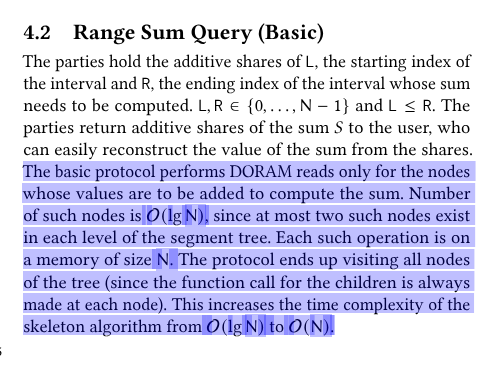

###  algorithm 3
- its written that doram access takes O(N) computation , i am assuming that this is because in this basic version we are using complete array for duoram not level wise.
- 7th line in : we are converting xor shares back to additive shares but we dont have to, doram can take xor shares or additive shares (may be internally they might get converted i am not sure about it)

### Section 4.2

- in this section are we going to discuss about recursive algorithm or the basic iterative version which uses uses complete Doram. bacause algorithm 4 is iterative but in the text it is written as 

