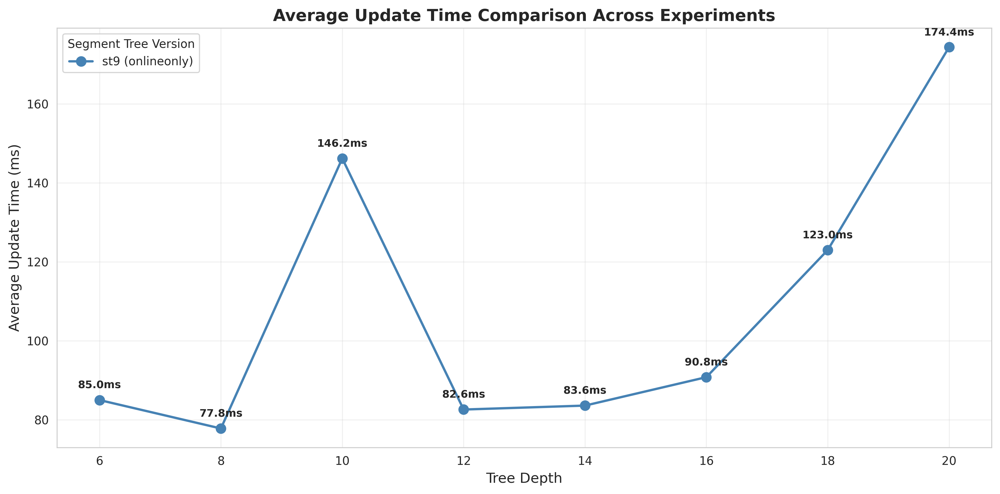
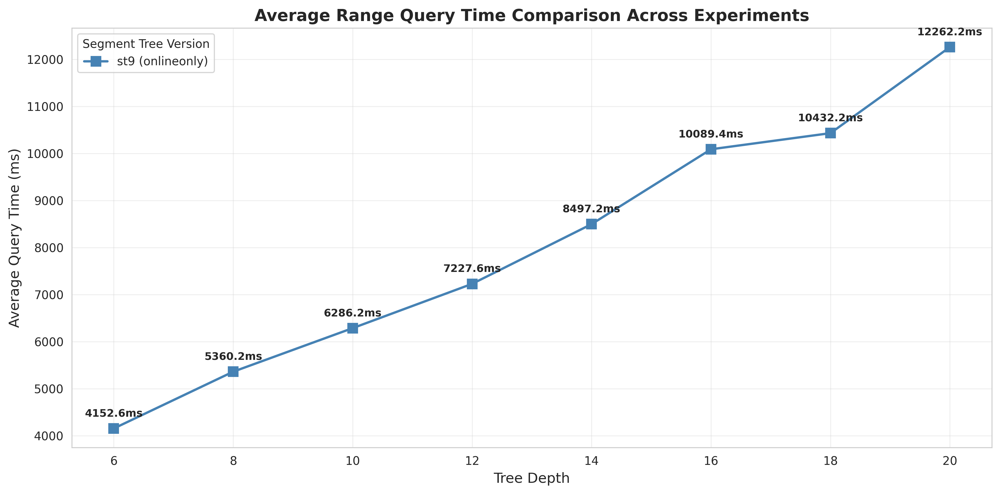
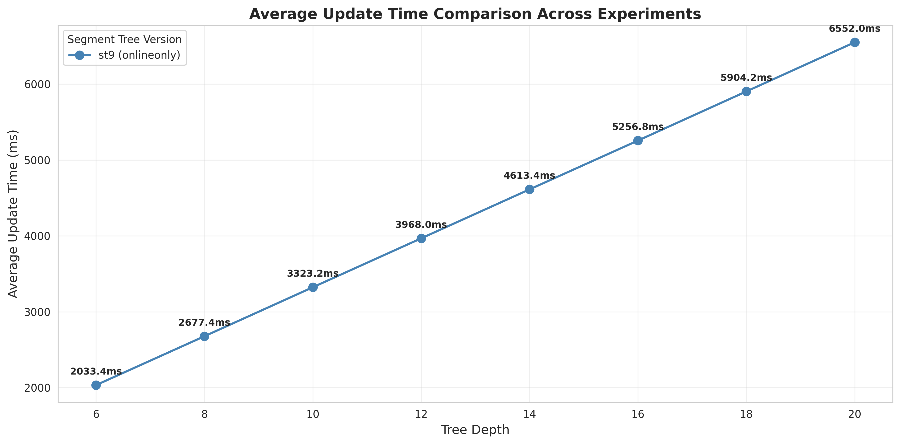
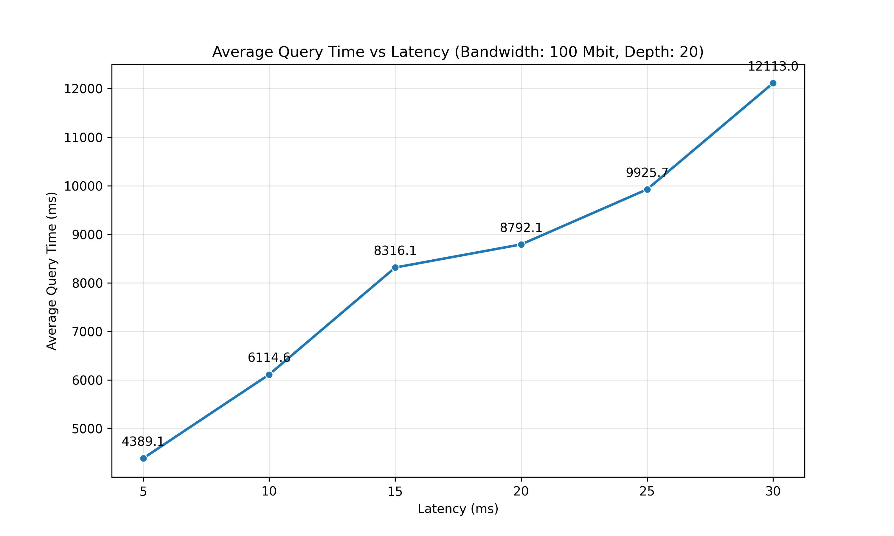
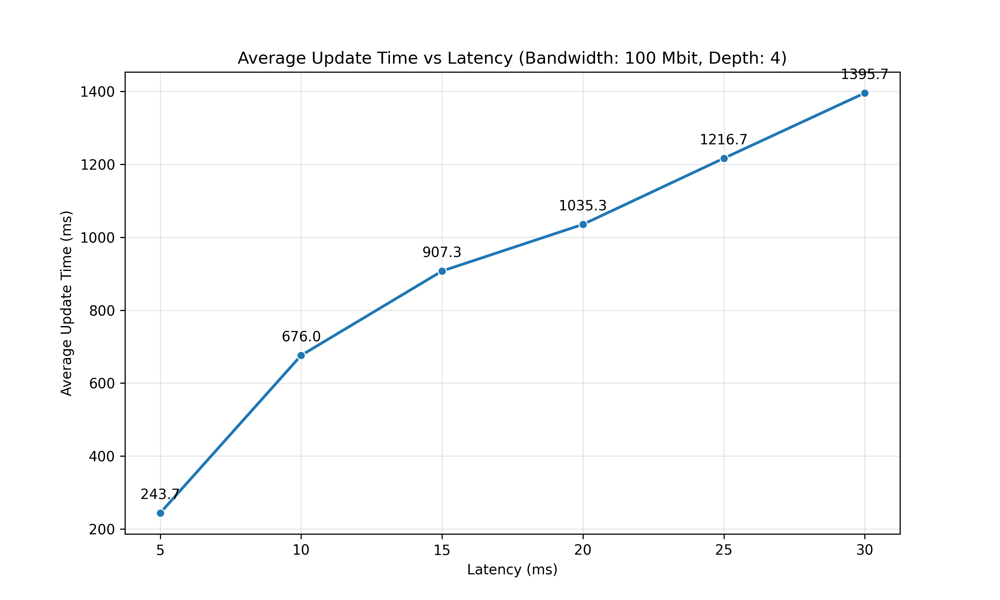
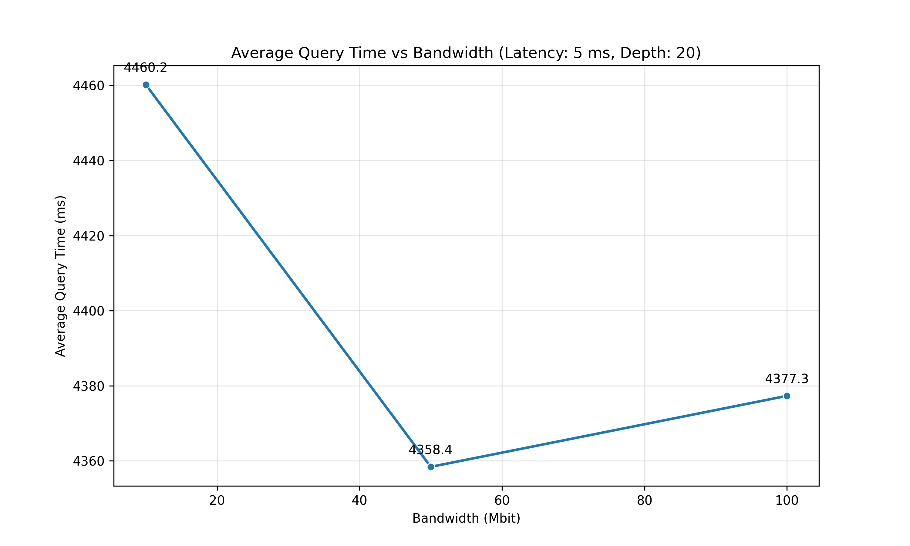
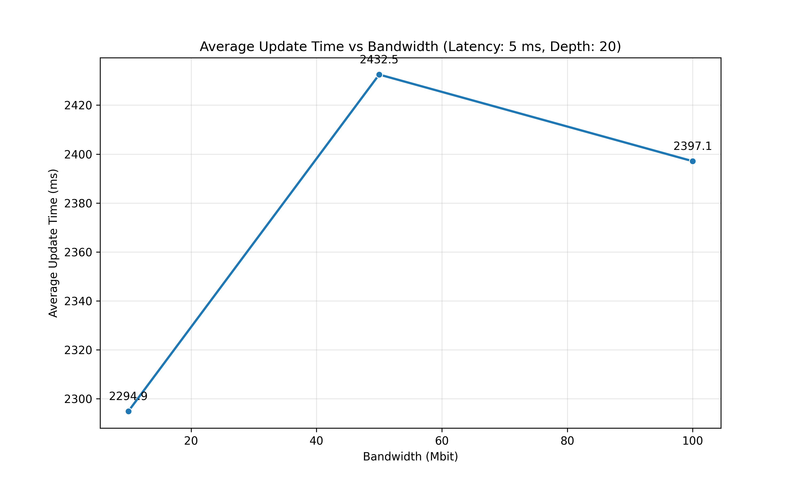
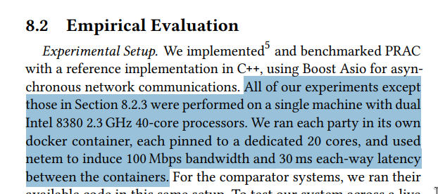

I am trying to test the entire system locally sir. For the experiments as we discussed the parameters that we decided are 
- depth
- latency
- bandwidth
- number of queries or updates

i started with varying depth first keeping all other constants.
#### case 1: i did not set any networking conditions

the results are similar to what we expected.

Average Query Time as we increase depth


Average Update Time as we increase depth


#### case 1: i used set-networking script
I used set-networking script to manually set network conditions among the docker containers.
i used default conditions for this experiment which are 
- latency: 30ms
- bandwidth: 100mbit

Average Query Time as we increase depth


Average Update Time as we increase depth


as You can see the numbers increased quite a lot from 1600ms (without network conditions) to 12000ms for a query on 20 depth tree. So next i tested varying the latency keeping 


### Varying latency keeping rest of the parameters constant

Average Query Time as we increase Latency


Average Update Time as we increase Latency


I ran experiments for latencies = (5ms 10ms 15ms 20ms 25ms 30ms). 

**Obsertvation**
I feel the average time taken for update and query is very large when we manuall set network conditions to default values which are also used in the PRAC paper.

### Varying Bandwidth keeping rest of the parameters constant

Average Query Time as we increase bandwidth


Average Update Time as we increase bandwidth


## Roadblocks and Doubts

- the iitk server that we have does not access to outside internet (ping google.com does not work) we can only do ssh or scp currently . so i am not able to  run docker which needs internet to pull the base image and libraries.
- in the prac paper it is written as



but when i execute the run-experiment script, the logs showed 
```bash
Usable cores: P0=12, P1=12, P2=12
```

My laptop contains 16 cores out of which 12 are usable. all the 3 parties are using these 12 cores. but the papers evaluation pinned each docker container to some specific set of dedicated cores.